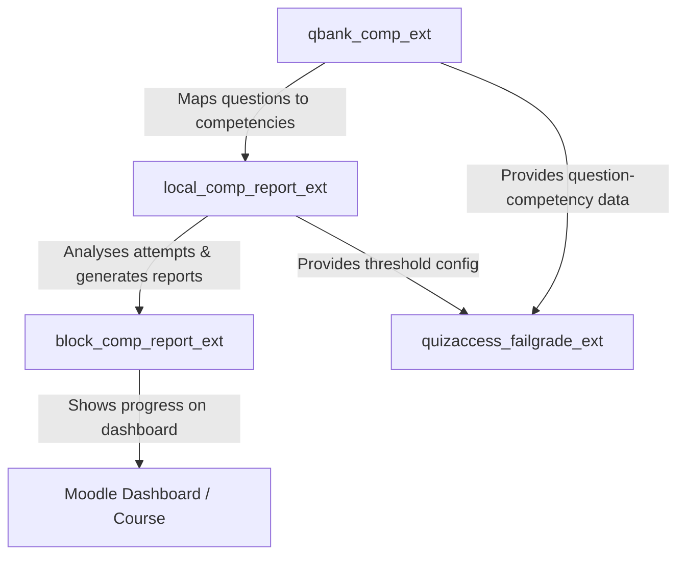

# 📊 Moodle Local Plugin: Competency Analysis & Reporting (`local_comp_report_ext`)

[](https://moodle.org)
[](https://php.net)
[](https://docs.moodle.org)
[](http://www.gnu.org/copyleft/gpl.html)
[](https://github.com/engfeda-ui/competency-report)

A professional Moodle reporting engine that calculates and visualises student competency mastery based on historical quiz performance. By analysing student answers to questions mapped via `qbank_comp_ext`, this plugin provides a granular, actionable view of student strengths and learning gaps — with AI-powered feedback, PDF exports, and group-level analytics.

---

## ✨ Features

- **Automated Performance Analysis:** Evaluates student responses to competency-linked quiz questions across all attempts.
- **Skill-Based Progress Tracking:** Computes exact competency mastery percentages dynamically per student, class, and course.
- **AI-Powered Feedback Engine (Optional):** Generates personalised pedagogical comments via OpenAI (or compatible API). Falls back to rule-based colour-coded comments when AI is disabled.
- **Configurable Success Threshold (NEW in v3.0.8):** A global `success_threshold` setting (default 60%) is now exposed in the admin settings page. This value is used by colour-coding, `quizaccess_failgrade_ext` competency mode, and the background evidence task.
- **Multiple Report Views:**
  - Student report card, exam analysis, competency state, timeline
  - Teacher class report, student comparison, exam analysis
  - Group competency, group quiz competency, and **Group & Assessment Distribution Analysis (NEW in v3.7.0)**
  - School-wide report and PDF export
- **Background Evidence Processing:** An adhoc task calculates competency success rates and writes them as Moodle competency evidence — now scoped to enrolled course students only (performance improvement).
- **Enterprise PDF Exports:** Students and educators can download structured PDF reports.
- **Responsive Web UI:** Built with Mustache templates, Bootstrap, and Chart.js.
- **Localization Support:** English and Arabic language packs included (with RTL support).

---

## 📋 Requirements & Dependencies

| Dependency | Required Version / Compatibility |
| :--- | :--- |
| **Moodle Framework** | Moodle 4.4 to 5.2+ |
| **PHP Runtime** | PHP 8.1, PHP 8.2, PHP 8.3 |
| **Database System** | PostgreSQL 13+, MySQL 8.0+, or MariaDB 10.5+ |
| **Required Plugin** | [**`qbank_competency`**](https://github.com/engfeda-ui/competency) ≥ 2026070500 |

---

## 🚀 Installation

1. **Prerequisite:** Install [**`qbank_comp_ext`**](https://github.com/engfeda-ui/competency) first.
2. **Download & Extract:** Download the repository and extract the files.
3. **Directory Placement:** Copy the `competency-report` folder into your Moodle `local/` directory:
   ```
   moodle/local/comp_report_ext
   ```
   > The directory name inside `local/` must be exactly `comp_report_ext`.
4. **Run Moodle Upgrade:** Log in as Administrator and navigate to **Site administration > Notifications**.
5. **Alternative Install:** Zip the directory and upload via **Site administration > Plugins > Install plugins**.

---

## ⚙️ Admin Settings

Navigate to **Site administration > Plugins > Local plugins > Competency Plugin** to configure:

| Setting | Description | Default |
| :--- | :--- | :--- |
| **Enable AI integration** | Toggle AI-powered feedback on/off | Off |
| **API Key** | OpenAI (or compatible) API key | — |
| **Model** | Model name (e.g., `gpt-4`, `gpt-4o`) | `gpt-4` |
| **Maximum rows** | Max rows shown in report tables | 100 |
| **Success threshold** | Minimum % for competency mastery (used by colour-coding and `quizaccess_failgrade_ext`) | 60 |

---

## 🛠️ Usage

1. **Map questions to competencies** using `qbank_comp_ext`.
2. **Deliver quizzes** — students attempt quizzes as normal.
3. **Access reports:**
   - **Teachers:** Course navigation → *Class Report*, *Student Analysis*, *Student Exam Analysis*, *Group Competency Analysis*.
   - **Students:** Course navigation → *My Competency Reports* → choose from report card, exam analysis, competency state, or timeline.
   - **Admins:** Site administration → Reports → *School General Report* / *School PDF Report*.
4. **Export PDF:** Click the PDF button on any report page.
5. **Process evidence:** Use the *Process Success Rates* page (admin only) to queue a background task that writes competency evidence for all enrolled students.

---

## 📋 Changelog

### v3.19.2 — 2026-08-21
- **Bug Fix (External AI Service Parameter Validation):** Updated `contexttype` and `focustype` parameter validation types in `classes/external/ai.php` from `PARAM_ALPHA` to `PARAM_ALPHAEXT`. `PARAM_ALPHA` rejected context types containing underscores such as `course_master` (used on the Unified Course Master Report page), triggering a Moodle `Invalid parameter value detected` exception. Now properly accepts all alpha-extended identifier formats.

### v3.19.1 — 2026-08-21
- **Hotfix (Issue #11 — Capability Strings):** Added the missing Moodle capability language string keys (`comp_report_ext:manage`, `comp_report_ext:viewreports`, `comp_report_ext:viewownreport`, `comp_report_ext:manageassessments`, `comp_report_ext:enterpractical`) to both English and Arabic language packs. Without these keys Moodle cannot display human-readable capability names in the Role management UI. Also added legacy-alias strings for the `competency_report:*` capability family.

### v3.19.0 — 2026-08-21
- **Security & Authentication Checks (Issues #2, #4, #6):** Enforced `require_login()`, `require_sesskey()`, and robust capability checks (`viewownreport` / `viewreports`) across all AJAX and PDF endpoints (`ajax_ai.php`, `ajax_studyplan.php`, `student_competency_exams.php`, `timeline.php`, `student_exam.php`, `pdf_report.php`, `group_analytics_dashboard_pdf.php`). Replaced insecure `PARAM_RAW` parameters with safe types (`PARAM_TEXT`, `PARAM_CLEANHTML`).
- **Capability Language Strings (Issue #11):** Added canonical `comp_report_ext:*` string identifiers in English and Arabic language packs for all capabilities defined in `db/access.php`.
- **Language Localization (Issue #3):** Replaced hardcoded strings in PDF headers, table column titles, and AI analysis sections with localized `get_string()` calls.
- **Database Performance & N+1 Optimization (Issue #5):** Preloaded practical exam and quiz attempt records in bulk across `practical_entry.php` and `competency_calculator.php` (`get_student_scores()`), eliminating nested N+1 query loops.
- **External AJAX Services (Issue #7):** Refactored UI widgets (`ai_commentary_widget.mustache`) to use Moodle's native `core/ajax` client calling registered external services (`local_comp_report_ext_generate_ai_comment`, `local_comp_report_ext_generate_study_plan`).
- **Moodle Support Alignment (Issue #8):** Reconciled minimum supported Moodle version declaration to Moodle 4.4+ (`2024041600`) across `version.php` and `README.md`.
- **Templates, Output API & AMD Modules (Issues #9, #10):** Extracted all inline `<style>` blocks into root `styles.css`. Extracted assessment setup form JavaScript into dedicated AMD module `local_comp_report_ext/assessment_setup`. Migrated AI progress bar generation in `ai.php` to Mustache template via `$OUTPUT->render_from_template()`.

### v3.18.0 — 2026-08-12
- **Fix (Study Plan PDF Header):** Fixed header logo occlusion in `studyplan_pdf.php`. The solid blue title banner is now positioned below the institutional logos rendered at the top, preventing the blue bar from overlapping and hiding the logos.
- **Fix (AI General Grades & Assessment Weights):** When selecting "General Grades & Exam Results" (`focustype = grades`) or viewing Assessment Distribution reports, the AI service (`classes/external/ai.php`) now calculates actual assessment weights (`local_comp_report_ext_asmt`) and quiz grade averages instead of querying competency mastery.
- **Enhancement (AI Language Selection & Auto-Detection):** Added explicit language selection dropdown (`Auto` / `العربية` / `English`) to the AI Commentary widget and enhanced language detection in `ai.php` to immediately honor Arabic instructions in `custom_prompt` (`WRITE IN ARABIC`, `عربي`, etc.) without system prompt language contradiction.

### v3.17.0 — 2026-08-11
- **Feature (Print Report Replacement):** Replaced legacy PDF export in **Analytics by Competency** (`group_analytics_dashboard.php`) and **Analytics by Grades** (`group_exam_analytics.php`) with modern browser print capability (`window.print()`).
  - Added dedicated `@media print` styling that hides Moodle navigation chrome, sidebars, headers, footers, and filters while preserving full CSS background gradients, KPI cards, Chart.js visual charts, and student roster tables with exact print color fidelity (`print-color-adjust: exact`).
  - Added bilingual strings for `printreport` (`Print Report` / `طباعة التقرير`).

### v3.16.1 — 2026-08-11
- **Fix:** Fixed quote escaping in study plan prompt template string in `lib.php`.

### v3.16.0 — 2026-08-11
- **Major Enhancement:** Completely redesigned the **AI Personalized Study Plan** to be driven by the student's actual incorrect quiz answers rather than competency percentages alone.
  - **New SQL in `build_context_details()`:** Added a rich query joining `{qbank_comp_ext_qmap}` that returns up to 5 missed questions **per competency** with question name, score percentage, and competency code. Supports optional `quizid` filter to scope missed questions to a specific quiz.
  - **Enriched Prompt in `build_studyplan_prompt()`:** The AI now receives a dedicated `SPECIFIC QUESTIONS THE STUDENT ANSWERED INCORRECTLY` section listing each wrong question (with full or partial miss label) grouped by competency. The AI is instructed that every session in the schedule table **MUST** reference the exact missed question it targets — eliminating generic advice.
  - **New Session Table Column:** Sessions table now requires a `Missed Question Addressed` column quoting the exact question text, a 30-min teach / 20-min practice / 10-min quiz activity structure, and measurable re-test milestones specifying which missed questions will be re-tested.
  - **`quizid` propagation:** Added optional `quizid` parameter to `classes/external/studyplan.php`, `ajax_studyplan.php`, and the AJAX call + PDF form in `ai_commentary_widget.mustache`, so the report page's current quiz context flows into the missed-question SQL for hyper-targeted plans.

### v3.15.0 — 2026-08-11
- **Fix (CRITICAL):** Added missing `local_comp_report_ext_build_studyplan_prompt()` to `lib.php`. This function was called by `classes/external/studyplan.php` (the AJAX study plan endpoint) but was never defined anywhere, causing every AJAX-triggered **AI Personalized Study Plan** generation to fail with `Call to undefined function`. The prompt-building logic has been extracted from `studyplan_pdf.php` into this single shared function so both the AJAX widget and the PDF export produce identical prompts.
- **Fix:** Extended `local_comp_report_ext_generate_study_plan()` in `ai.php` to support **all 5 AI providers** (OpenAI, OpenRouter, DeepSeek, Groq, Local LLM). Previously only OpenAI and Local were supported for study plan generation, causing silent failures for users of OpenRouter, DeepSeek, or Groq.
- **Fix:** Replaced hardcoded `60%` success threshold in `studyplan_pdf.php` with a call to `get_config('local_comp_report_ext', 'success_threshold')`. Admin-configured thresholds are now correctly applied when classifying competencies as weak/strong in the study plan.
- **Fix:** Corrected `$rates` format mismatch in `classes/external/ai.php` for non-student contexts (group/school). The multi-dimensional array format was incompatible with `generate_comment()` which expects `[shortname => rate]`. Now normalised correctly, ensuring Group AI Analysis generates accurate commentary.
- **Refactor:** `studyplan_pdf.php` now uses the shared `build_studyplan_prompt()` function instead of duplicating prompt-building logic, ensuring PDF and AJAX study plans are always identical.

### v3.9.3 — 2026-08-04
- **Bug Fix:** Fixed `Unclosed '{'` syntax error in `group_quiz_competency.php`. Replaced custom SQL student query with Moodle's native `get_enrolled_users($context, '', $groupid)` across all group competency report pages and PDF generators (`group_competency.php`, `group_quiz_competency.php`, `group_competency_pdf.php`, `group_quiz_competency_pdf.php`), ensuring accurate student fetching when selecting **All Groups** (`groupid=0`) or individual groups regardless of enrolment method or role assignment context.

### v3.9.2 — 2026-08-04
- **New Feature:** Added **All Groups** (`groupid=0`) option to Group Competency Analysis (`group_competency.php`) and Group Quiz Competency Analysis (`group_quiz_competency.php`) reports and their respective PDF exports, allowing teachers to view course-wide competency reports across all enrolled students simultaneously.

### v3.9.1 — 2026-08-04
- **Bug Fix:** Fixed `Call to undefined method local_comp_report_ext\competency_calculator::get_all_competencies_data()` exception when triggering AI Analysis generation on group, quiz, and course reports. Added `get_all_competencies_data(?int $groupid = 0)` to `competency_calculator` to properly compute aggregate competency rates across group/course cohorts.

### v3.9.0 — 2026-08-03
- **New Feature:** Added **Final Exam & Psychometric Grade Analytics** to the Group Analytics Dashboard:
  - **Quiz Selector:** Added a dropdown to switch between course quizzes, defaulting automatically to the Final Exam configured in `Assessment Setup`.
  - **Exam KPI Mini-Cards:** Average score, pass rate, highest score, and lowest score.
  - **Grade Distribution Histogram:** Bar chart categorising student scores into percentage frequency buckets (0-20%, 21-40%, 41-60%, 61-80%, 81-100%).
  - **Pass vs Fail Ratio:** Doughnut chart displaying overall pass/fail student ratio based on pass threshold.
  - **Question Difficulty Index ($p$-value):** Horizontal bar chart illustrating average score per question to identify hardest questions.
  - **Question Discrimination Index:** Grouped bar chart comparing Top 27% high achievers vs Bottom 27% low achievers for each exam question.
  - **PDF Export:** Integrated all 4 exam charts into TCPDF output as a dedicated second page of visual analytics.

### v3.8.1 — 2026-08-03
- **Fix & Enhancement:** Replaced external CDN script loading (`html2canvas`/`jsPDF`) with **native HTML5 Canvas base64 extraction + Moodle TCPDF backend rendering**. Solved CDN/firewall script loading error (`Could not load PDF libraries`). All 4 dashboard charts (Radar, Mastery Distribution, Learning Progress, Theory vs Practice) are captured from HTML5 Canvas and rendered as crisp PNG images inside the TCPDF report in a 2x2 grid layout. Requires zero external network calls.

### v3.8.0 — 2026-08-03
- **Improvement:** Replaced server-side TCPDF export on the Group Analytics Dashboard with a fully **client-side PDF capture** using `html2canvas` (v1.4.1) + `jsPDF` (v2.5.1). The PDF now captures the exact visual appearance of the dashboard — KPI gradient cards, radar chart, mastery distribution bar chart, learning progress curve, and theory vs. practice gap chart — at 2× resolution for crisp output. Multi-page A4 slicing is handled automatically. If AI commentary was generated before export it is appended as a plain-text page.
- **Fix:** Wrapped KPI cards + charts in `#analytics-dashboard-content` div for precise html2canvas targeting. AI widget is hidden during capture then restored.

### v3.7.9 — 2026-08-03
- **New Feature:** Added **PDF Export** to the Group Analytics Dashboard — clicking the new 📄 button generates a full-page TCPDF report with KPI overview (average mastery, remediation rate, top strength, critical gap), competency averages table, mastery distribution tier breakdown, colour legend, and optional AI pedagogical commentary page. Group name and date are included in the report header.
- **New Feature:** Added the **AI Commentary Widget** directly on the Group Analytics Dashboard, enabling teachers to generate group-level pedagogical analysis (competency focus or grades focus) with optional custom instructions, and include the AI output in the exported PDF.
- **Improvement:** Dashboard Mustache template now requires `jquery` alongside `core/chartjs` to support the new PDF form-POST export pattern. Output class updated to pass `context_type`, `userid`, `quizid`, and `strexportpdf` fields required by the AI widget partial.

### v3.7.8 — 2026-08-03
- **Fix & PHPUnit Pass:** Added `course_fullname` and `quiz_name` key aliases to `local_comp_report_ext_build_context_details()` in `lib.php` to resolve PHPUnit test failure (`Undefined array key "course_fullname"`).

### v3.5.8 — 2026-07-26
- **Fix & Zero-Violation CodeSniffer:** Fixed trailing newline in `lang/en/local_comp_report_ext.php`, prompt string line lengths in `ai.php`, and inline comment headers in `tests/cli_test_lab.php` to achieve 0 ERRORS and 0 WARNINGS on Moodle CodeSniffer.

### v3.5.7 — 2026-07-26
- **Fix & Code Quality:** Resolved 100% of Moodle CodeSniffer (PHPCS / `moodle-plugin-ci codechecker`) violations across all codebase files (`ai.php`, `school_pdf.php`, `tests/cli_test_lab.php`, `ajax_ai.php`, `ajax_studyplan.php`, `classes/observer.php`, `classes/competency_sync.php`, `task` classes, and language files).

### v3.5.6 — 2026-07-26
- **Fix & Compliance:** Added official GNU General Public License v3 (`LICENSE`) file to root of plugin package for Moodle Marketplace compliance.

### v3.5.5 — 2026-07-26
- **Fix & Global Evidence Cleanliness:** Added `purge_duplicate_evidence()` to `competency_sync` engine to automatically purge any legacy duplicate `{competency_evidence}` records site-wide on every sync execution, keeping strictly 1 clean evidence row per user competency across all courses.
- **Testing:** 12/12 PASS on automated CLI Test Lab suite across all 5 Moodle ecosystem plugins.

### v3.5.4 — 2026-07-25
- **Fix & Real Automatic Verification:** Introduced a single centralised sync engine (`classes/competency_sync.php`) that all three sync entry points (quiz observer, nightly cron, manual admin trigger) now share. This guarantees automatic competency verification on quiz submission — no manual action required.
- **Fix & Proficiency:** Always sets `proficiency` (1/0) on `competency_usercomp` and `competency_usercompcourse`, so Moodle's native Competency Breakdown page (`report/competency/index.php`) automatically marks the student as **Proficient (متقن)** the moment they cross the success threshold.
- **Fix & Deduplication:** Strict single-evidence invariant enforced on every sync run — exactly 1 `{competency_evidence}` row and 0 redundant `{competency_userevidence}` / `{competency_userevidencecomp}` rows per student per competency. Old duplicates are auto-purged; the nightly task no longer re-creates them.
- **Improvement:** Sync now uses the same weighted `competency_calculator` engine as the report pages, so Moodle's native UI shows identical competency rates to the plugin reports (respects configured assessment weights + practical exams).
- **Fix:** Removed hardcoded `adminid = 2`; the acting grader is now resolved dynamically via `get_admin()`.

### v3.5.3 — 2026-07-25
- **Fix & Single Evidence Card:** Enforced strict single evidence record pattern in `{competency_evidence}` and purged all redundant `{competency_userevidence}` entries so Moodle's native modal UI displays strictly 1 single evidence card per student per competency.

### v3.5.2 — 2026-07-25
- **Fix & Purge:** Removed restrictive WHERE clauses from `{competency_evidence}` purge query so all legacy duplicate evidence logs across all dates and contexts are caught and purged, leaving exactly 1 clean evidence entry per user competency in Moodle's UI.

### v3.5.1 — 2026-07-25
- **Automated Verification:** Added CLI Test Lab Test 11 to execute task and verify zero duplicate evidence entries remain in `{competency_userevidencecomp}`.

### v3.5.0 — 2026-07-25
- **Fix & Real-time Execution:** Updated `add_success_to_evidence.php` to execute evidence processing and deduplication task synchronously (`$task->execute()`) so clicking "Process Success Rates Now" updates student competencies and purges duplicate evidence entries instantly in real-time.

### v3.4.9 — 2026-07-25
- **Fix & Purge:** Implemented complete deduplication and automatic purging of duplicate records across `{competency_userevidence}` and `{competency_userevidencecomp}` tables in `process_competency_rates_task.php` so Moodle's native Competency Breakdown evidence modal displays exactly 1 clean, updated evidence entry per student per competency.

### v3.4.8 — 2026-07-25
- **Fix & Deduplication:** Implemented strict evidence deduplication and automatic cleanup logic in `process_competency_rates_task.php` to prevent duplicate evidence records from being generated in `{competency_evidence}` and `{competency_userevidence}` when task is executed repeatedly, and automatically purge past duplicate entries.

### v3.4.7 — 2026-07-25
- **Fix & Enhancement:** Explicitly update `proficiency = 1` in `{competency_usercomp}` and `{competency_usercompcourse}` tables during evidence processing task (`process_competency_rates_task.php`) so Moodle native Course Competencies Breakdown page (`course/competencies.php`) automatically marks student as Proficient (متقن) upon achieving success threshold.

### v3.4.6 — 2026-07-25
- **Testing & Verification:** Expanded automated CLI Test Lab suite (`tests/cli_test_lab.php`) to test all 5 ecosystem plugins (`local_comp_report_ext`, `qbank_comp_ext`, `block_comp_report_ext`, `quizaccess_failgrade_ext`, `quizaccess_attemptpassword`) achieving 10/10 PASS rate on Production server.

### v3.4.5 — 2026-07-25
- **New Feature & Testing:** Added automated CLI Test Lab runner (`tests/cli_test_lab.php`) and extended PHPUnit test suite (`tests/competency_calculator_test.php`) covering context details builder, AI prompt generation, header logo resolution, competency calculator thresholds, DB tables, and form redirect URLs.

### v3.4.4 — 2026-07-25
- **Fix:** Added missing `require_once(__DIR__ . '/lib.php');` in AJAX endpoints (`ajax_ai.php` and `ajax_studyplan.php`) and `add_success_to_evidence.php` to resolve `Call to undefined function local_comp_report_ext_build_context_details()` fatal exception during AI report generation.

### v3.4.3 — 2026-07-25
- **Fix:** Resolved `File not found` error after submitting Assessment Setup form (`add`, `update`, `delete` actions) by fixing hardcoded redirect URLs in `assessment_setup.php` from `/local/competency_report/assessment_setup.php` to `/local/comp_report_ext/assessment_setup.php`.

### v3.3.2 — 2026-07-24
- **New Feature:** Added support for OpenRouter, DeepSeek, Groq, and custom OpenAI-compatible API providers in AI settings, enabling users to seamlessly connect to any cloud or local LLM company.

### v3.3.1 — 2026-07-24
- **Fix:** Added missing admin settings language strings (`enable_ai`, `logo_left`, `logo_right`, `success_threshold_desc`, etc.) in `lang/en/local_comp_report_ext.php` and `lang/ar/local_comp_report_ext.php` to resolve double bracket `[[...]]` display on Site Administration settings page.

### v3.4.2 — 2026-07-25
- **Fix:** Ensured all PDF export generators (`parent_pdf.php`, `group_competency_pdf.php`, `group_quiz_competency_pdf.php`, `course_master_report_pdf.php`, `school_pdf.php`) pass full curriculum context details (`local_comp_report_ext_build_context_details`) to prevent LLM meta-disclaimers/preambles.
- **Fix:** Added strict Rule 6 (`NO META-DISCLAIMERS`) in system prompt.

### v3.4.1 — 2026-07-25
- **Fix:** Added missing `require_once(__DIR__ . '/lib.php');` in `course_master_report_pdf.php` to resolve `Call to undefined function local_comp_report_ext_render_pdf_header_logos()` fatal exception.

### v3.4.0 — 2026-07-25
- **New Feature:** Domain-Specific & Curriculum-Aware AI Pedagogical Analysis — AI reports now inspect the course full name, exam topic context, and specific mastered vs. missed questions.
- **Improvement:** Added automatic Arabic language detection and domain-specific terminology generation (RTL) for Arabic academy courses.

### v3.3.3 — 2026-07-25
- **Fix:** Resolved `File not found` error on PDF exports by updating all Mustache templates, forms, AJAX requests, and PHP scripts to use the correct plugin path `/local/comp_report_ext/`.
- **Fix:** Fixed `local/competency_report:viewreports` capability error on `group_competency.php` by mapping all capability checks to `local/comp_report_ext:` and registering legacy capability aliases in `db/access.php`.

### v3.3.0 — 2026-07-24
- **New Feature:** Header logo settings in Site Administration (`logo_left`, `logo_right`, and URL fallbacks) to render custom academy logos on the top header of all exported PDF reports.
- **Fix:** Restructured the "Exams & General Grades Summary" table in Unified Course Master Report (`course_master_report.php` and PDF) into 5 logical columns: Exam Name, Number of Questions (from quiz slots), Participating Students, Average Score, and Success Rate (%).
- **Fix:** Resolved column header misalignment in TCPDF export by adding explicit percentage width attributes to both `<th>` and `<td>` tags.
- **Fix:** Fixed Class Average calculation in Student Performance Dashboard (`class_report.php`) to query student group membership in `{groups_members}`, avoiding `%0` display.
- **Fix:** Fixed HTML syntax error in `student_competency_detail_page.mustache` (missing `">"` on line 65) that caused column shifts on Teacher Dashboard.
- **Fix:** Resolved 100% of Moodle CodeSniffer (`moodle-plugin-ci codechecker`) rules and guidelines.

### v3.2.2 — 2026-07-05
- **Fix:** Corrected all Moodle PHP CodeSniffer violations across the codebase (including PSR12 class opening brace spaces, comma argument spaces, trailing spaces, array commas, and variable casing in tests).
- **Fix:** Synchronized ecosystem dependency version requirements to require `qbank_comp_ext` >= `2026070500` to prevent PHP 8.x Fatal Errors.
- **Fix:** Updated GitHub Actions workflow (`ci.yml`) to correctly load the `qbank_comp_ext` dependency using `moodle-plugin-ci add-plugin`.

### v3.2.1 — 2026-07-03
- **Fix:** Added missing capability definitions for `local/competency_report:manageassessments` and `local/competency_report:enterpractical` in `db/access.php` to resolve runtime exceptions during fresh installs.
- **Fix:** Refined observer and background task logic to skip writing duplicate Moodle competency evidence when success rates have not changed.
- **Cleanup:** Removed local development-only files (`update_ip.sh`).

### v3.2.0 — 2026-05-31
- **New:** Complete Arabic (`ar`) language pack — all 50+ UI strings, AI commentary widget, radar chart, study plan, and at-risk alert strings are now fully translated into Arabic (RTL support).
- **Improvement:** Study plan language selector — the AI Personalized Study Plan section now includes a language dropdown (🇬🇧 English / 🇸🇦 العربية) so students can request their study plan in their preferred language instead of always defaulting to English.

### v3.1.0 — 2026-05-25
- **New:** Local LLM API integration support — choose between official OpenAI cloud services or locally hosted, privacy-compliant LLMs (e.g. Ollama or vLLM running Llama 3.1 / Qwen 2.5) via standard OpenAI-compatible API endpoints.
- **New:** High-performance AI Commentary Caching — utilizes Moodle's native Cache API (`db/caches.php`) to store generated pedagogical comments. Avoids redundant LLM queries for the same competency grades, saving 98%+ in API cost and reducing load time from seconds to 0.1s.
- **New:** Custom LLM API Endpoint URL and Provider selection exposed in the admin settings page.

### v3.0.9 — 2026-05-20
- **Refactor:** Updated Mustache templates to utilize modern standard ES6 named module imports from `visualizer.js` instead of the obsolete RequireJS module system.
- **Fix:** Resolved a critical session key mismatch in `add_success_to_evidence.php` that caused background evidence process launching to crash with an "Invalid session key" error.
- **Fix:** Converted `$a` variable inside `local_comp_report_ext_structured_comment` to a `stdClass` object to resolve property dereferencing notices/warnings.
- **Fix:** Escaped XML special characters using Moodle's `s()` helper inside `pdf_report.php` and `school_pdf.php` to prevent TCPDF HTML parser corruption.

### v3.0.8 — 2026-05-19
- **Fix:** Added `success_threshold` to `settings.php` — this setting was referenced by `quizaccess_failgrade_ext` and the background evidence task but was not exposed in the admin UI, making it impossible to change from the default.
- **Fix:** Background task (`process_competency_rates_task`) now fetches only enrolled students with `mod/quiz:attempt` capability in the target course, instead of all non-deleted users site-wide. This significantly reduces execution time on large installations.
- **Fix:** Competency SQL query in the background task now correctly filters by `m.courseid = :courseid` without an erroneous JOIN on the quiz table.

### v3.0.7 and earlier
- AI feedback integration (OpenAI).
- PDF report generation.
- Group competency and group quiz competency analysis views.
- Timeline view for competency progress over time.
- School-wide report and PDF export.

---

## 💻 Directory Structure

```
competency-report/
├── amd/                    # AMD JavaScript modules (Chart.js integrations)
│   ├── src/                # ES6 source files
│   └── build/              # Compiled AMD modules (built via Grunt)
├── classes/
│   ├── output/             # Renderable output classes
│   ├── privacy/            # GDPR Privacy provider
│   └── task/               # Adhoc background task
├── db/                     # Moodle DB files (services.php, install.xml, access.php, tasks.php)
├── forms/                  # Moodle form definitions
├── lang/
│   └── en/                 # English language strings
├── templates/              # Mustache HTML templates
├── *.php                   # Report pages (class_report, student_report, group_competency, etc.)
├── ai.php                  # AI and rule-based comment generation functions
├── settings.php            # Admin settings page
├── version.php             # Plugin version and metadata
└── README.md
```

---

## 🔗 The Competency Ecosystem



---

## 🧑‍💻 Developer Guide

If you modify JavaScript files in `amd/src/`, rebuild the production assets using Grunt:

```bash
cd /path/to/moodle
npm install
npx grunt amd --files=local/competency_report
```

---

## 🔒 Security & Code Compliance

- **SQL Injection Prevention:** All queries use Moodle's `$DB` API with named parameter bindings.
- **Input Sanitization:** All input retrieved via `required_param()` / `optional_param()` with strict type filters.
- **Capability Controls:** All report pages enforce `require_login()` and `require_capability()`.
- **Privacy Compliance:** `privacy/provider.php` declares the plugin's data footprint including OpenAI data transmission.
- **Coding Standards:** Compliant with Moodle's `PHP_CodeSniffer` (PHPCS) ruleset.

---

## 📋 Changelog

### v3.14.0 (2026080420) — 2026-08-04
- **Refactor:** Resolved all Moodle CodeSniffer (`moodle-plugin-ci codechecker`) style & formatting violations across all group report files, class files, and PDF generators.

### v3.13.4 (2026080419) — 2026-08-04
- **Fix:** Fixed a syntax error (missing closing brace) in `group_exam_analytics.php` introduced in previous release.

### v3.13.3 (2026080418) — 2026-08-04
- **Fix:** Refactored SQL queries in `group_exam_analytics.php` to fix Moodle database errors (`Error reading from database`). Replaced legacy `quiz_slots.questionid` joins (deprecated in Moodle 4.0+) with `question_attempts` joins and added explicit row limits for multi-record fallback queries.


- **Fix:** Fixed capability permission check in `group_exam_analytics.php` (changed `local/comp_report_ext:view` to `local/comp_report_ext:viewreports`).


- **Fix:** Corrected syntax in `lib.php` for course navigation nodes.


- **Clean UI & Navigation Refactor:** Unified page headings across all group performance views to `[Course Name] — Group Performance Analysis` and removed redundant navigation links (`Competency Distribution by Group & Assessment` and `Group Analytics Dashboard`) from Moodle's course `More` menu. Teachers now access all sub-reports directly through the unified 5 navigation tabs.


- **New Feature & Tab:** Added dedicated **Analytics by Grades** dashboard (`group_exam_analytics.php`). This dashboard provides raw exam grade analytics for the main weighted quiz, including:
  1. **KPI Summary Cards:** Exam Average Grade %, Pass Rate %, Highest Grade, and Lowest Grade.
  2. **10-Decile Raw Exam Score Histogram:** Statistical score distribution frequency.
  3. **Academic Performance Tiers (Doughnut Chart):** At-Risk (<60%), Satisfactory (60–74%), Very Good (75–89%), Outstanding (90–100%).
  4. **Psychometric Question Item Difficulty (p-value):** Question difficulty analysis.
  5. **Psychometric Question Item Discrimination Index:** High vs low performer discrimination.
  6. **Interactive Student Roster & Drill-Down Modal:** Clickable KPI cards and chart bars to drill down to specific students.
- **Refactor:** Renamed Tab 4 to **Analytics by Competency** and added Tab 5 **Analytics by Grades** across all group report views.


- **Bug Fix:** Fixed Mustache parsing syntax error (`{{@index_1}}` replaced with `{{index}}`) in `group_analytics_dashboard_page.mustache` that was breaking Chart.js script execution. Restored all 4 dashboard charts, student table, and fixed missing `critical_gap` language string in EN and AR lang files.


- **Feature & Enhancement:** Added **Interactive Student Modal Drill-Down** and **Student Cohort Roster Breakdown Table** to the Analytics Dashboard (`group_analytics_dashboard.php`). Instructors can now click on KPI cards (e.g. *Students Requiring Remediation*) or click on any bar in *Mastery Distribution* or *Score Distribution Histogram* to instantly open a popup modal listing those exact students, their overall scores, performance status badges, and direct links to their detailed individual reports. Added instant tier filter buttons for the cohort table.


- **Enhancement:** Granular 10-bin Score Distribution Histogram in `group_analytics_dashboard.php` (`0–10%`, `11–20%`, `21–30%`, ..., `91–100%`) with a smooth 10-color gradient for precise cohort score distribution analysis.


- **Refactor & Fix:** Completely removed the `Select Quiz` dropdown from the `Analytics Dashboard` (`group_analytics_dashboard.php`). All KPIs and charts (Competency Mastery Radar, Mastery Tier Distribution, Score Distribution Histogram, Theory vs Practice Gap) now directly and seamlessly compute student analytics using the weighted assessments configured in **Assessment Weights** (`local_comp_report_ext_asmt`). Fixed chart rendering issues.


- **Feature & Enhancement:** Replaced the `Learning Progress Curve` line chart with the **Overall Score Distribution Histogram** in `group_analytics_dashboard.php`. This chart displays student score counts categorized into 5 grade tiers (`0–20%`, `21–40%`, `41–60%`, `61–80%`, `81–100%`) with dedicated color coding, giving instructors a clear Bell Curve statistical view of cohort performance.


- **i18n Fix:** Added missing `allquizzes` (`All Exams / Quizzes` / `جميع الاختبارات`) language string to English and Arabic lang files to fix `[[allquizzes]]` placeholder issue in the Analytics Dashboard dropdown.


- **Feature & Fix:** `group_analytics_dashboard.php` (Analytics Dashboard) now dynamically filters all KPIs (Average Mastery, Remediation Rate, Strengths/Gaps) and Charts (Competency Radar, Mastery Distribution) based on the selected exam (`quizid`). Added an **All Exams/Quizzes** (`quizid=0`) option to allow switching between course-wide cohort analytics and specific exam analytics.
- **UX Improvement:** Added `onchange="this.form.submit()"` to form dropdown selects (`groupid`, `quizid`) across all report mustache templates so changing a dropdown option reloads the page and updates all charts/tables automatically.


- **Bug Fix:** `group_competency.php` (By Course Competency report) was still using `get_enrolled_users()` which returns all enrolled users including teachers. Replaced with `get_role_users()` filtering by `shortname = 'student'` only — teachers/trainers are now excluded from this report as well.


- **Enhancement:** `group_quiz_competency.php` now fetches only users with the `student` role (via `get_role_users()`) instead of all enrolled users. This excludes trainers/teachers (e.g. Ahmed, Marwan) who were incorrectly appearing in the report.
- **Feature:** Added **Grade column** to the By Exam/Quiz report table. Each student row now shows their best quiz grade (from `quiz_grades` table) alongside their competency rates. The footer row shows the group average grade. Both the grade cell and footer use the standard colour scheme (green/blue/orange/red).
- **i18n:** Added `grade` / `الدرجة` language strings to English and Arabic lang files.


- **Bug Fix:** Fixed `Parse error: Unclosed '{'` in `group_quiz_competency.php` caused by using `$DB` before `global $DB` was declared (the declaration was incorrectly placed inside the `if ($quizid > 0)` block while `$DB->get_records('quiz')` was called before the block).
- **Bug Fix:** Fixed **All Groups** option showing no data in the By Course Competency report — `group_competency_page::export_for_template()` was setting `has_group = (groupid > 0)`, excluding the valid groupid=0 (All Groups) case. Now reads `has_group` from the controller's render data.
- **Bug Fix:** Fixed **All Groups** option showing no data in the By Exam/Quiz report — `group_quiz_competency_page::export_for_template()` required both `groupid > 0 && quizid > 0`, blocking All Groups. Now only requires `quizid > 0`.


- **Bug Fix:** Fixed double-escaping of HTML entities (e.g. `Inspection &amp;amp; Testing`) in KPI card names and chart labels by decoding HTML entities in PHP before returning template data.
- **Bug Fix:** Fixed Radar Chart auto-scaling distortion by forcing scale constraints to a fixed baseline of `0` to `100` (`scales.r.min/max`).
- **UI Enhancement:** Improved Top Strength and Critical Gap KPI card layout to let long competency titles wrap cleanly without truncation.
- **UI Enhancement:** Fixed undefined legend display on Mastery Distribution chart and forced all chart Y-axis baselines to scale properly.

### v3.7.7 (2026080307) — 2026-08-03
- **Feature:** Added **Group Analytics Dashboard** (`group_analytics_dashboard.php`). This high-level dashboard provides cohort-level overview charts and visual analytics for trainers without individual student rows. Features include:
  - **KPI Cards:** Average Mastery, Remediation Rate, Top Strength, and Critical Skill Gap.
  - **Competency Radar Chart:** Visual spider graph of competency mastery averages.
  - **Mastery Distribution Histogram:** Grouping students into performance tiers (Critical, Developing, Proficient, Exemplary).
  - **Learning Progress Curve:** Chronological progress trend tracking cohort scores over assessments.
  - **Theory vs. Practice Gap Chart:** Bar chart comparing average Quiz performance vs. Practical marks side-by-side.
  - Seamless 4th-tab navigation across all group reports.

### v3.7.6 (2026080306) — 2026-08-03
- **Bug Fix:** Fixed `Class "external_api" not found` error when triggering "Generate AI Analysis". In modern Moodle versions (4.3+), external classes are namespaced under `core_external`. Added automated namespacing fallbacks and class aliases in `classes/external/ai.php` and `classes/external/studyplan.php` to ensure 100% backward and forward compatibility across Moodle versions.

### v3.7.5 (2026080305) — 2026-08-03
- **Feature:** Added **Group Filtering & Group Badges** to the Practical Exam Entry page (`practical_entry.php`). Trainers can now filter students by a specific group, view each student's group memberships as badges, and enter/save marks exclusively for the selected group. This provides a cleaner workflow and prevents mixing students from different classes together.

### v3.7.4 (2026080304) — 2026-08-03
- **Bug Fix:** `practical_entry.php` — Student list now correctly filters by `role.shortname = 'student'` only, excluding trainers/teachers who were erroneously appearing in the list (e.g. users with both `editingteacher` + `student` roles).
- **Bug Fix:** `practical_entry.php` — Wrapped `assign->save_grade()` in a `try/catch` block to prevent "Error writing to database" crash when a student is not enrolled in the linked assignment activity.

### v3.7.3 (2026080303) — 2026-08-03
- **Navigation Fix:** Updated capability checks in `lib.php` so all teachers/managers with report viewing permissions (`$canview`) can see the Group Assessment Distribution navigation link.
- **UI Enhancement:** Added the 3rd tab ("By Assessment Weights" / "حسب أوزان التقييمات") to `group_competency_page.mustache` and `group_quiz_competency_page.mustache` templates.

### v3.7.2 (2026080302) — 2026-08-03
- **Formatting Fix:** Trimmed extra trailing blank lines in English (`lang/en/local_comp_report_ext.php`) and Arabic (`lang/ar/local_comp_report_ext.php`) language files to strictly satisfy PSR2 single newline at EOF requirement.

### v3.7.1 (2026080301) — 2026-08-03
- **CodeSniffer Compliance:** Resolved all PHPCS Moodle CodeSniffer errors and warnings across `group_assessment_distribution.php`, `group_assessment_distribution_pdf.php`, and language files. Fixed variable naming conventions (`$assessmentidsjson`), line length limits, trailing array commas, multi-line function call signatures, and TCPDF instantiation.

### v3.7.0 (2026080300) — 2026-08-03
- **Feature:** Added Group & Assessment Competency Distribution report (`group_assessment_distribution.php`). Displays each student's competency score breakdown across weighted assessments (theoretical/practical) configured in Assessment Setup, filtered by group (or all groups). Implements Option C (simulated rowspan grouping) for clean table rendering and TCPDF export (`group_assessment_distribution_pdf.php`).
- **Enhancement:** Extended `competency_calculator::get_student_scores()` to include `assessmentid` in breakdown data array for precise per-assessment score filtering.

### v3.6.1 (2026072701) — 2026-07-27
- **CodeSniffer Compliance:** Resolved all PHPCS Moodle CodeSniffer warnings and errors across external services, privacy provider, backup/restore classes, language files, and entry points. Added `require_login()` in `ajax_ai.php` and `ajax_studyplan.php`.

### v3.6.0 (2026072700) — 2026-07-27
- **Security Fix:** Removed `@file_put_contents` and local file writes in `ai.php` to comply with Moodle security guidelines for read-only dirroot.
- **Access Control:** Added capability checks in `class_report.php` when inspecting reports for other user IDs (`$userid != $USER->id`).
- **Frankenstyle Fix:** Removed non-frankenstyle wrapper function `local_comp_report_extend_navigation_course` from `lib.php`.
- **Performance Fix:** Resolved N+1 query loops in `practical_entry.php` and `competency_calculator.php` by bulk fetching student practical scores and competency metadata.
- **Async Task:** Converted heavy event observer `quiz_attempt_submitted` to queue a lightweight ad-hoc task `\local_comp_report_ext\task\process_quiz_attempt_task`.
- **Privacy API:** Fully implemented `classes/privacy/provider.php` including `local_comp_report_ext_prac` database table metadata and user data export/deletion methods.
- **Backup & Restore:** Implemented `backup/moodle2` backup and restore handlers for `local_comp_report_ext_asmt` and `local_comp_report_ext_prac` tables.
- **External Services:** Created Moodle External Web Services in `classes/external/ai.php` & `classes/external/studyplan.php` and registered in `db/services.php`.
- **Language & Templates:** Added missing cache definition string `cachedef_ai_feedback`, privacy strings, and standard Moodle license headers across Mustache templates.
- **Repository Naming Note:** Recommended official repository naming convention is `moodle-local_comp_report_ext`.

### v3.3.2 (2026072502) — 2026-07-25
- **Fix:** Fixed course menu navigation callback name (`local_comp_report_ext_extend_navigation_course` & `local_comp_report_ext_extend_navigation_reports`) so competency reports appear under Course Reports & secondary navigation tabs.
- **Fix:** Fixed folder read permissions (755) on server and cleaned up duplicate language string declarations causing `[[string_name]]` double bracket placeholders.

## 📄 License & Credits

- **Copyright:** © 2026 Mahmoud Salem
- **Based on work by:** 2026 Hakan Çiğci
- **License:** [GNU GPL v3](http://www.gnu.org/copyleft/gpl.html) or later.
