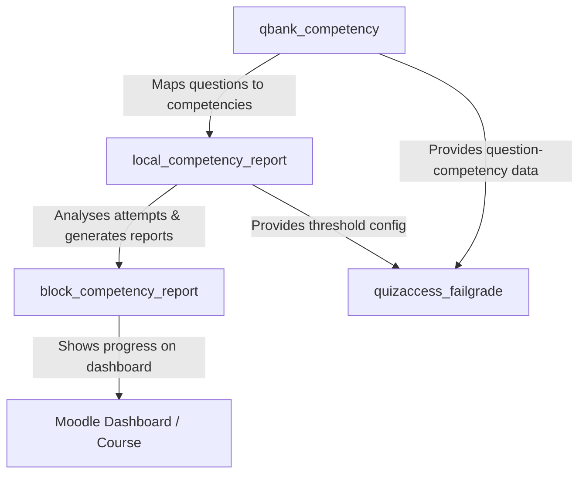

# 📊 Moodle Local Plugin: Competency Analysis & Reporting (`local_competency_report`)

[](https://moodle.org)
[](https://php.net)
[](https://docs.moodle.org)
[](http://www.gnu.org/copyleft/gpl.html)
[](https://github.com/engfeda-ui/competency-report)

A professional Moodle reporting engine that calculates and visualises student competency mastery based on historical quiz performance. By analysing student answers to questions mapped via `qbank_competency`, this plugin provides a granular, actionable view of student strengths and learning gaps — with AI-powered feedback, PDF exports, and group-level analytics.

---

## ✨ Features

- **Automated Performance Analysis:** Evaluates student responses to competency-linked quiz questions across all attempts.
- **Skill-Based Progress Tracking:** Computes exact competency mastery percentages dynamically per student, class, and course.
- **AI-Powered Feedback Engine (Optional):** Generates personalised pedagogical comments via OpenAI (or compatible API). Falls back to rule-based colour-coded comments when AI is disabled.
- **Configurable Success Threshold (NEW in v3.0.8):** A global `success_threshold` setting (default 60%) is now exposed in the admin settings page. This value is used by colour-coding, `quizaccess_failgrade` competency mode, and the background evidence task.
- **Multiple Report Views:**
  - Student report card, exam analysis, competency state, timeline
  - Teacher class report, student comparison, exam analysis
  - Group competency and group quiz competency analysis
  - School-wide report and PDF export
- **Background Evidence Processing:** An adhoc task calculates competency success rates and writes them as Moodle competency evidence — now scoped to enrolled course students only (performance improvement).
- **Enterprise PDF Exports:** Students and educators can download structured PDF reports.
- **Responsive Web UI:** Built with Mustache templates, Bootstrap, and Chart.js.
- **Localization Support:** English and Turkish language packs included.

---

## 📋 Requirements & Dependencies

| Dependency | Required Version / Compatibility |
| :--- | :--- |
| **Moodle Framework** | Moodle 4.5 to 5.0+ |
| **PHP Runtime** | PHP 8.1, PHP 8.2, PHP 8.3 |
| **Database System** | PostgreSQL 13+, MySQL 8.0+, or MariaDB 10.5+ |
| **Required Plugin** | [**`qbank_competency`**](https://github.com/engfeda-ui/competency) ≥ 2026052500 |

---

## 🚀 Installation

1. **Prerequisite:** Install [**`qbank_competency`**](https://github.com/engfeda-ui/competency) first.
2. **Download & Extract:** Download the repository and extract the files.
3. **Directory Placement:** Copy the `competency-report` folder into your Moodle `local/` directory:
   ```
   moodle/local/competency_report
   ```
   > The directory name inside `local/` must be exactly `competency_report`.
4. **Run Moodle Upgrade:** Log in as Administrator and navigate to **Site administration > Notifications**.
5. **Alternative Install:** Zip the directory and upload via **Site administration > Plugins > Install plugins**.

---

## ⚙️ Admin Settings

Navigate to **Site administration > Plugins > Local plugins > Competency Plugin** to configure:

| Setting | Description | Default |
| :--- | :--- | :--- |
| **Enable AI integration** | Toggle AI-powered feedback on/off | Off |
| **API Key** | OpenAI (or compatible) API key | — |
| **Model** | Model name (e.g., `gpt-4`, `gpt-4o`) | `gpt-4` |
| **Maximum rows** | Max rows shown in report tables | 100 |
| **Success threshold** | Minimum % for competency mastery (used by colour-coding and `quizaccess_failgrade`) | 60 |

---

## 🛠️ Usage

1. **Map questions to competencies** using `qbank_competency`.
2. **Deliver quizzes** — students attempt quizzes as normal.
3. **Access reports:**
   - **Teachers:** Course navigation → *Class Report*, *Student Analysis*, *Student Exam Analysis*, *Group Competency Analysis*.
   - **Students:** Course navigation → *My Competency Reports* → choose from report card, exam analysis, competency state, or timeline.
   - **Admins:** Site administration → Reports → *School General Report* / *School PDF Report*.
4. **Export PDF:** Click the PDF button on any report page.
5. **Process evidence:** Use the *Process Success Rates* page (admin only) to queue a background task that writes competency evidence for all enrolled students.

---

## 📋 Changelog

### v3.1.0 — 2026-05-25
- **New:** Local LLM API integration support — choose between official OpenAI cloud services or locally hosted, privacy-compliant LLMs (e.g. Ollama or vLLM running Llama 3.1 / Qwen 2.5) via standard OpenAI-compatible API endpoints.
- **New:** High-performance AI Commentary Caching — utilizes Moodle's native Cache API (`db/caches.php`) to store generated pedagogical comments. Avoids redundant LLM queries for the same competency grades, saving 98%+ in API cost and reducing load time from seconds to 0.1s.
- **New:** Custom LLM API Endpoint URL and Provider selection exposed in the admin settings page.

### v3.0.9 — 2026-05-20
- **Refactor:** Updated Mustache templates to utilize modern standard ES6 named module imports from `visualizer.js` instead of the obsolete RequireJS module system.
- **Fix:** Resolved a critical session key mismatch in `add_success_to_evidence.php` that caused background evidence process launching to crash with an "Invalid session key" error.
- **Fix:** Converted `$a` variable inside `local_competency_report_structured_comment` to a `stdClass` object to resolve property dereferencing notices/warnings.
- **Fix:** Escaped XML special characters using Moodle's `s()` helper inside `pdf_report.php` and `school_pdf.php` to prevent TCPDF HTML parser corruption.

### v3.0.8 — 2026-05-19
- **Fix:** Added `success_threshold` to `settings.php` — this setting was referenced by `quizaccess_failgrade` and the background evidence task but was not exposed in the admin UI, making it impossible to change from the default.
- **Fix:** Background task (`process_competency_rates_task`) now fetches only enrolled students with `mod/quiz:attempt` capability in the target course, instead of all non-deleted users site-wide. This significantly reduces execution time on large installations.
- **Fix:** Competency SQL query in the background task now correctly filters by `m.courseid = :courseid` without an erroneous JOIN on the quiz table.

### v3.0.7 and earlier
- AI feedback integration (OpenAI).
- PDF report generation.
- Group competency and group quiz competency analysis views.
- Timeline view for competency progress over time.
- School-wide report and PDF export.

---

## 💻 Directory Structure

```
competency-report/
├── amd/                    # AMD JavaScript modules (Chart.js integrations)
│   ├── src/                # ES6 source files
│   └── build/              # Compiled AMD modules (built via Grunt)
├── classes/
│   ├── output/             # Renderable output classes
│   ├── privacy/            # GDPR Privacy provider
│   └── task/               # Adhoc background task
├── db/                     # Moodle DB files (services.php, install.xml, access.php, tasks.php)
├── forms/                  # Moodle form definitions
├── lang/
│   └── en/                 # English language strings
├── templates/              # Mustache HTML templates
├── *.php                   # Report pages (class_report, student_report, group_competency, etc.)
├── ai.php                  # AI and rule-based comment generation functions
├── settings.php            # Admin settings page
├── version.php             # Plugin version and metadata
└── README.md
```

---

## 🔗 The Competency Ecosystem



---

## 🧑‍💻 Developer Guide

If you modify JavaScript files in `amd/src/`, rebuild the production assets using Grunt:

```bash
cd /path/to/moodle
npm install
npx grunt amd --files=local/competency_report
```

---

## 🔒 Security & Code Compliance

- **SQL Injection Prevention:** All queries use Moodle's `$DB` API with named parameter bindings.
- **Input Sanitization:** All input retrieved via `required_param()` / `optional_param()` with strict type filters.
- **Capability Controls:** All report pages enforce `require_login()` and `require_capability()`.
- **Privacy Compliance:** `privacy/provider.php` declares the plugin's data footprint including OpenAI data transmission.
- **Coding Standards:** Compliant with Moodle's `PHP_CodeSniffer` (PHPCS) ruleset.

---

## 📄 License & Credits

- **Copyright:** © 2026 Mahmoud Salem
- **Based on work by:** 2026 Hakan Çiğci
- **License:** [GNU GPL v3](http://www.gnu.org/copyleft/gpl.html) or later.
