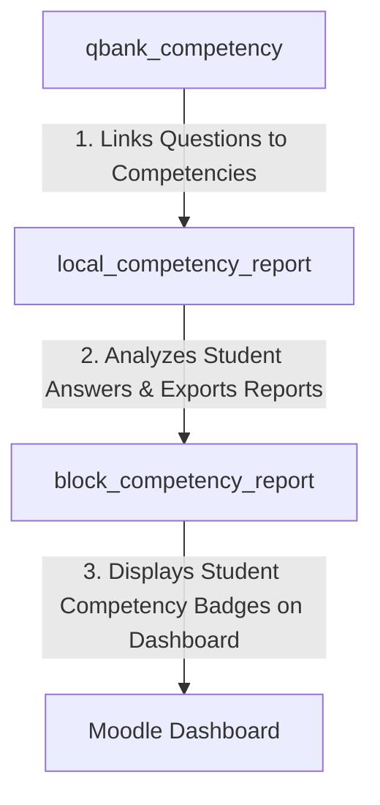

# 📊 Moodle Local Plugin: Competency Analysis & Reporting (`local_competency_report`)

[](https://moodle.org)
[](https://php.net)
[](https://docs.moodle.org)
[](http://www.gnu.org/copyleft/gpl.html)

A professional Moodle reporting engine that calculates and visualizes student competency mastery based on historical quiz performance. By parsing student answers to questions mapped to specific competencies via `qbank_competency`, this plugin provides a granular, actionable view of student strengths and learning gaps.

It features beautifully designed progress tracking, automatic motivational coaching advice, and professional PDF report generation.

---

## ✨ Features

- **Automated Performance Analysis:** Evaluates student responses to competency-linked quiz questions across all attempts.
- **Skill-Based Progress Tracking:** Computes exact competency mastery percentages dynamically.
- **Motivational Feedback Engine:** Automatically generates color-coded visual thresholds (e.g., green/yellow/red) paired with positive, motivational academic advice.
- **Enterprise PDF Exports:** Allows students and educators to download beautiful, structured PDF reports of their competency profiles.
- **Responsive Web UI:** Built with modern CSS grid layouts, smooth CSS transitions, and fully responsive layouts that fit any device.
- **Localization Support:** Complete translation packs for both English (`en`) and Turkish (`tr`).
- **Seamless Integration:** Serves as the middle-tier reporting core, linking `qbank_competency` data mapping with the `block_competency_report` dashboard widgets.

---

## 📋 Requirements & Dependencies

| Dependency | Required Version / Compatibility |
| :--- | :--- |
| **Moodle Framework** | Moodle 4.5 to 5.0+ (Tested against Moodle 4.5/5.0+ stable branches) |
| **PHP Runtime** | PHP 8.1, PHP 8.2, PHP 8.3 |
| **Database System** | PostgreSQL 13+, MySQL 8.0+, or MariaDB 10.5+ |
| **Required Plugin** | **`qbank_competency`** (Must be installed and configured first) |

---

## 🚀 Installation

Follow these steps to install the plugin manually:

1. **Prerequisite:** Ensure that you have already installed the [**`qbank_competency`**](https://github.com/engfeda-ui/moodle-qbank_competency) plugin.
2. **Download & Extract:** Download the repository and extract the files.
3. **Directory Placement:** Copy the `competency-report` folder into your Moodle installation's local plugins directory:
   ```bash
   moodle/local/competency_report
   ```
   *Note: Ensure the directory name inside `local/` is exactly `competency_report`.*
4. **Run Moodle Upgrade:** Log in to your Moodle site as an Administrator and navigate to **Site administration > Notifications** to trigger the database upgrade and complete the installation.
5. **Alternative Install:** Alternatively, zip the directory and upload it via **Site administration > Plugins > Install plugins**.

---

## 🛠️ Usage & Configuration

1. **Link Competencies to Questions:** First, use the `qbank_competency` plugin to link questions inside your Question Bank to your course's competencies.
2. **Deliver Quizzes:** Let students take quizzes containing these mapped questions as normal.
3. **Access Reports:**
   - **Educators:** Navigate to **Course administration > Reports > Competency Report** to see an overview of all student competency achievements.
   - **Students:** Click the **Competency Report** link inside the course or via the dashboard block to view their individual skill matrix, visual charts, and feedback.
4. **Export PDF:** Click the **"Export Report as PDF"** button at the top of the report to generate and download a clean print-ready report.

---

## 💻 Directory Structure

```text
competency-report/
├── amd/                    # AMD JavaScript modules for frontend interactions
│   ├── src/                # ES6 Source JavaScript files
│   └── build/              # Transpiled AMD modules (built via Grunt)
├── classes/                # Autoloaded PHP classes (business logic, PDF generation, data query)
├── db/                     # Moodle DB files (services.php, install.xml, access.php)
├── lang/                   # Language localization packs
│   ├── en/                 # English translations
│   └── tr/                 # Turkish translations
├── pix/                    # Assets and icon graphics
├── templates/              # Mustache HTML templates (Report view layouts)
├── version.php             # Moodle plugin version and dependency definition
└── README.md               # Professional documentation
```

---

## 🔗 The Competency Ecosystem

This plugin is the core reporting backend of a 3-tier Moodle competency-based education suite:



---

## 🧑‍💻 Developer Guide (Compilation & Customization)

This plugin uses Moodle's modern frontend AMD module system. If you modify any JavaScript files in `amd/src/`, you must rebuild the minified production assets in `amd/build/` using Grunt:

```bash
# Navigate to Moodle root directory
cd /path/to/moodle

# Install Node.js dependencies
npm install

# Run Grunt compilation for this specific plugin
npx grunt amd --files=local/competency_report
```

---

## 📄 License & Credits

- **Copyright:** © 2026 Hakan Çiğci ([https://hakancigci.com.tr](https://hakancigci.com.tr))
- **License:** Licensed under the [GNU GPL v3 License](http://www.gnu.org/copyleft/gpl.html) (or later).